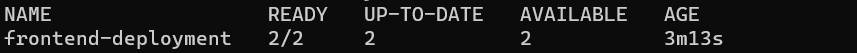
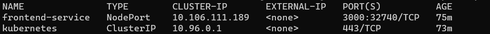
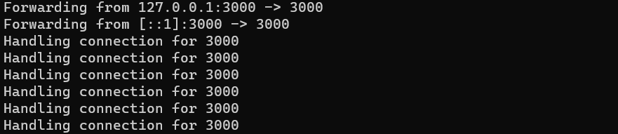
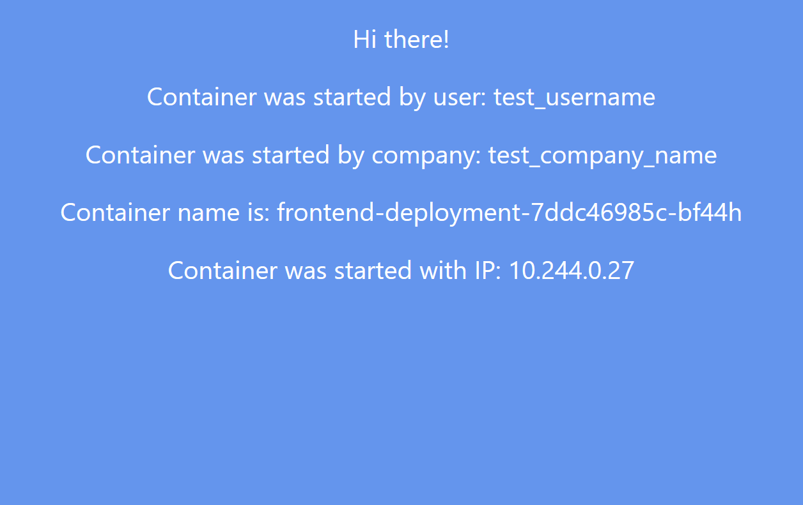
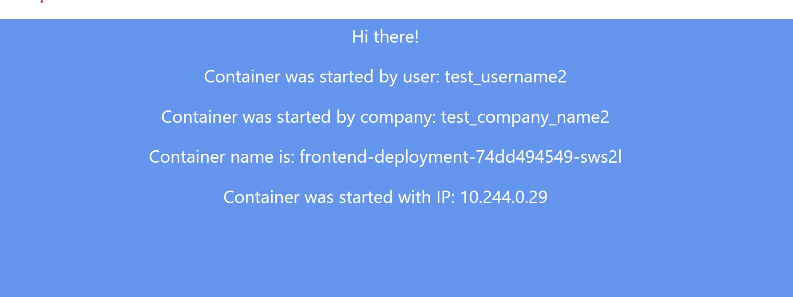
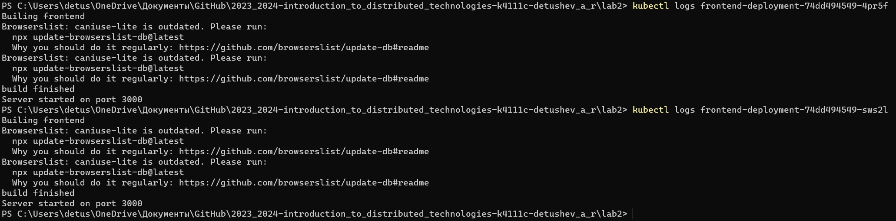
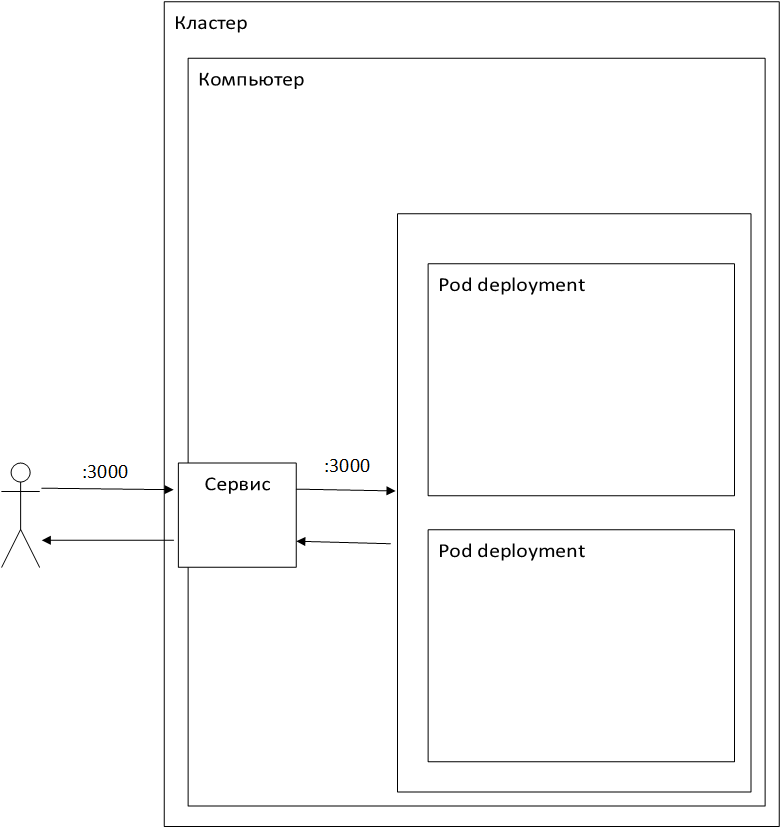

University: [ITMO University](https://itmo.ru/ru/) \
Faculty: [FICT](https://fict.itmo.ru) \
Course: [Introduction to distributed technologies](https://github.com/itmo-ict-faculty/introduction-to-distributed-technologies) \
Year: 2023/2024 \
Group: K4111C \
Author: Detushev Artem R. \
Lab: Lab2 \
Date of create: 07.11.2023 \
Date of finished: 16.11.2023

# Лабораторная работа №2 "Развертывание веб сервиса в Minikube, доступ к веб интерфейсу сервиса. Мониторинг сервиса."

## Содержание

- [Содержание](#содержание)
- [Введение](#введение)
- [Ход работы](#ход-работы)
  - [Создание Deployment](#создание-deployment)
  - [Создание Service](#создание-service)
- [Cхема](#схема)

## Введение

**Цель работы:** \
Ознакомиться с типами "контроллеров" развертывания контейнеров, ознакомится с сетевыми сервисами и развернуть свое веб приложение.\
**Задачи:** 

- Необходимо создать deployment с 2 репликами контейнера ifilyaninitmo/itdt-contained-frontend:master и передать переменные в эти реплики: REACT_APP_USERNAME, REACT_APP_COMPANY_NAME. 
- Создать сервис через который у вас будет доступ на эти "поды". Выбор типа сервиса остается на ваше усмотрение. 
- Запустить в minikube режим проброса портов и подключитесь к вашим контейнерам через веб браузер. 
- Проверьте на странице в веб браузере переменные REACT_APP_USERNAME, REACT_APP_COMPANY_NAME и Container name. Изменяются ли они? Если да то почему? 
- Проверьте логи контейнеров, приложите логи в отчёт. 

## Ход работы

### Создание Deployment

Для создания deployment был написан манифест, который можно найти в файле **deployment.yaml**. \
Далее для запуска манифеста используем команду **kubectl apply -f deployment.yaml**. \
Для проверки воспользуемся командой **kubectl get deployment**. 

### Создание Service

Для создания service был написан манифест, который можно найти в том же файле **deployment.yaml**, а также был проброшен порт наружу. \
Для проверки сервиса воспользуемся командой **kubectl get service**. 

Далее для доступа к поду воспользуемся командой **kubectl port-forward service/frontend-service 3000:3000**

### Приложение

При подключении к приложении по адресу: **127.0.0.1:3000** нам возвращается следующая страница:

При изменении параметров в манифесте и повторном использовании команды **kubectl apply -f deployment.yaml**, изменения вступаю в силу и в UI мы увидим изменения.

Используя команду **kubectl logs** Получим логи от веб-сервиса, получив список подов, а потом запросив логи из них:

## Схема

