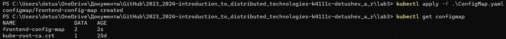
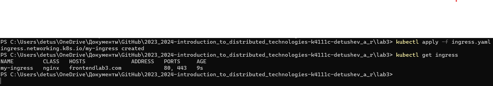

University: [ITMO University](https://itmo.ru/ru/) \
Faculty: [FICT](https://fict.itmo.ru) \
Course: [Introduction to distributed technologies](https://github.com/itmo-ict-faculty/introduction-to-distributed-technologies) \
Year: 2023/2024 \
Group: K4111C \
Author: Detushev Artem R. \
Lab: Lab3 \
Date of create: 07.11.2023 \
Date of finished: ? 

# Лабораторная работа №3 "Сертификаты и "секреты" в Minikube, безопасное хранение данных."

## Содержание

- [Содержание](#содержание)
- [Введение](#введение)
- [Ход работы](#ход-работы)
  - [Создание Deployment](#создание-deployment)
  - [Создание Service](#создание-service)
- [Cхема](#схема)

## Введение

**Цель работы:**

Познакомиться с сертификатами и "секретами" в Minikube, правилами безопасного хранения данных в Minikube.

**Задачи:**

- Необходимо создать configMap с переменными: REACT_APP_USERNAME, REACT_APP_COMPANY_NAME.
- Необходимо создать replicaSet с 2 репликами контейнера ifilyaninitmo/itdt-contained-frontend:master и используя ранее созданный configMap передать переменные REACT_APP_USERNAME, REACT_APP_COMPANY_NAME.
- Включить minikube addons enable ingress и сгенерировать TLS сертификат, импортировать сертификат в minikube.
- Создать ingress в minikube, где указан ранее импортированный сертификат, FQDN по которому вы будете заходить и имя сервиса который вы создали ранее.
- В hosts пропишите FQDN и IP адрес вашего ingress и попробуйте перейти в браузере по FQDN имени.
- Войдите в веб приложение по вашему FQDN используя HTTPS и проверьте наличие сертификата.

## Ход работы

**Создание СonfigMap**

Для создания СonfigMap был написан манифест, который можно найти в файле **СonfigMap.yaml**. \
Далее для запуска манифеста используем команду **kubectl apply -f СonfigMap.yaml**. \
Для проверки воспользуемся командой **kubectl get configmap**. 

**Создание ReplicaSet**

Для создания ReplicaSet был написан манифест, который можно найти в файле **ReplicaSet.yaml**. \
Далее для запуска манифеста используем команду **kubectl apply -f ReplicaSet.yaml**. \
Для проверки воспользуемся командой **kubectl get replicaset**. 

Далее включаем ingress командой **minikube addons enable ingress**. \
Затем нехобходимо создать TLS-сертификат и передать его в minikube. \
Для создания TLS-сертификатов можно воспоьзоваться разными инструментами, такими как: Cert-Manager, Let's Encrypt, Cloud Providers и Самоподписанные сертификаты. \
Для выпуска самоподписанного сертификата я воспользуюсь сервисом seag.pro ![https://seag.pro/tools/ssl-generator/ru] для учебных целей. \
Далее создадим секрет в minikube из сертификата с помощью команды **kubectl create secret tls my-tls-secret --cert=certificate.crt --key=private.key**. \
Для проверки воспользуемся командой **kubectl get secret**

Для создания Ingress был написан манифест, который можно найти в файле **ingress.yaml**. \
Далее для запуска манифеста используем команду **kubectl apply -f ingress.yaml**. \
Для проверки воспользуемся командой **kubectl get ingress**. 

