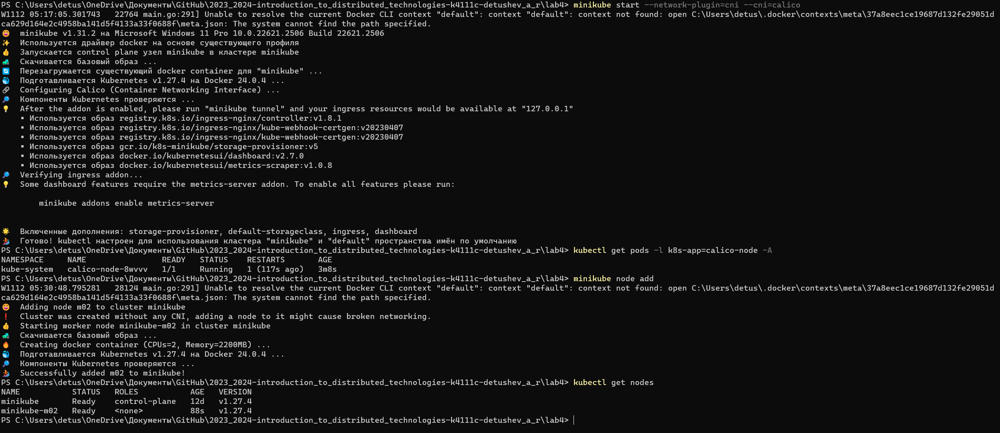
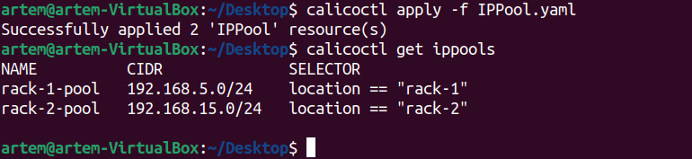
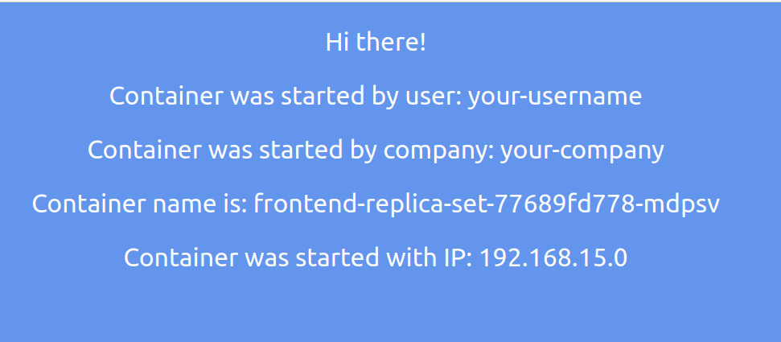
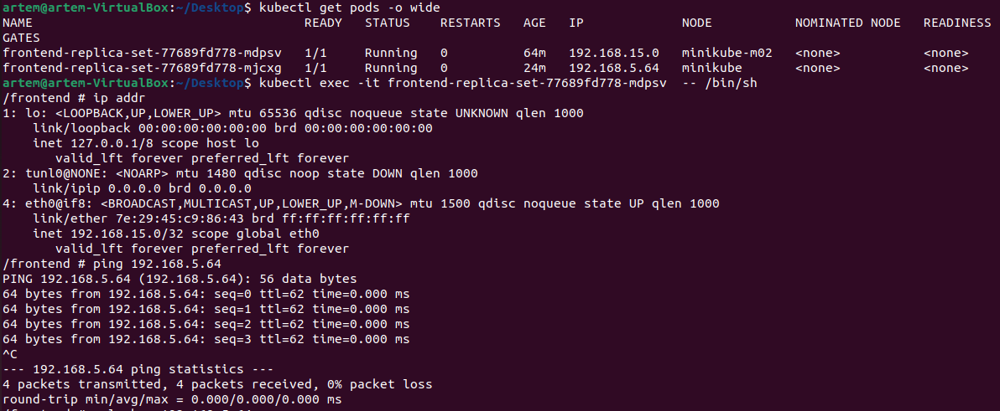
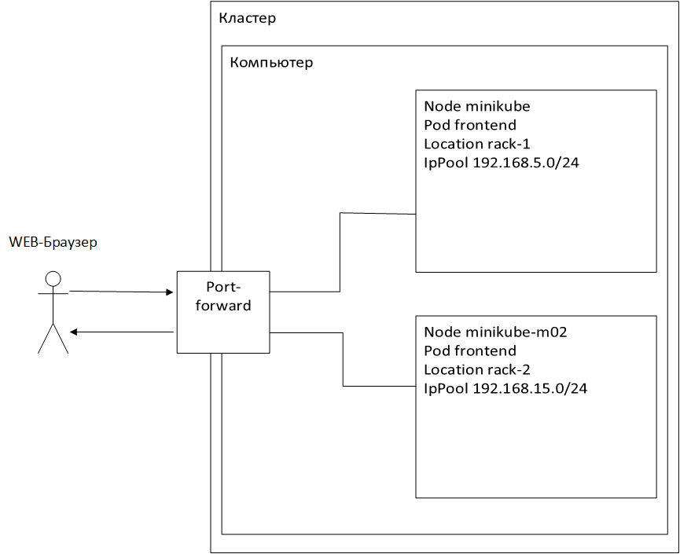

University: [ITMO University](https://itmo.ru/ru/) \
Faculty: [FICT](https://fict.itmo.ru) \
Course: [Introduction to distributed technologies](https://github.com/itmo-ict-faculty/introduction-to-distributed-technologies) \
Year: 2023/2024 \
Group: K4111C \
Author: Detushev Artem R. \
Lab: Lab4 \
Date of create: 12.11.2023 \
Date of finished: ? 

# Лабораторная работа №4 "Сети связи в Minikube, CNI и CoreDNS"

## Содержание

- [Содержание](#содержание)
- [Введение](#введение)
- [Ход работы](#ход-работы)
  - [Запуск 2 нод с аддоном calico](#Запуск-2-нод-с-аддоном-calico)
  - [Работа с IPAM Plugin](#Работа-с-IPAM-Plugin)
- [Cхема](#схема)

## Введение

**Цель работы:**

Познакомиться с CNI Calico и функцией IPAM Plugin, изучить особенности работы CNI и CoreDNS.

**Задачи:**

- При запуске minikube установите плагин CNI=calico и режим работы Multi-Node Clusters одновеременно, в рамках данной лабораторной работы вам нужно развернуть 2 ноды.
- Проверьте работу CNI плагина Calico и количество нод, результаты проверки приложите в отчет.
- Для проверки работы Calico мы попробуем одну из функций под названием IPAM Plugin.
- Для проверки режима IPAM необходимо для запущеных ранее нод указать label по признаку стойки или географического расположения (на ваш выбор).
- После этого вам необходимо разработать манифест для Calico который бы на основе ранее указанных меток назначал бы IP адреса "подам" исходя из пулов IP адресов которые вы указали в манифесте.
- Вам необходимо создать deployment с 2 репликами контейнера ifilyaninitmo/itdt-contained-frontend:master и передать переменные в эти реплики: REACT_APP_USERNAME, REACT_APP_COMPANY_NAME.
- Создать сервис через который у вас будет доступ на эти "поды". Выбор типа сервиса остается на ваше усмотрение.
- Запустить в minikube режим проброса портов и подключитесь к вашим контейнерам через веб браузер.
- Проверьте на странице в веб браузере переменные Container name и Container IP. Изменяются ли они? Если да то почему?
- Используя kubectl exec зайдите в любой "под" и попробуйте попинговать "поды" используя FQDN имя соседенего "пода", результаты пингов необходимо приложить к отчету.

## Ход работы

**Запуск 2 нод с аддоном calico**

Для начала работы необходим включить minikube с плагином CNI(Container Network Interface), в работе будет использоваться CNI Calico. Так же есть такие плагины как: Flannel, Weave Net, Canal, Cilium, Multus, Antrea. Это только некоторые из множества CNI плагинов, доступных в Kubernetes платформе.\
Для этого воспользуемся командой **minikube start --network-plugin=cni --cni=calico**.\
Для проверки установки Calico воспользуемся командой **kubectl get pods -l k8s-app=calico-node -A**.\
Чтобы у нас было 2 ноды необходимо воспользоваться командой **minikube node add**.\
Для проверки используем команду **kubectl get nodes**.

**Работа с IPAM Plugin**

Для начала необходимо дать нодам произвольные лейблы например города. В данном примере будут использоваться SPB и MSC.\
Для этого необходимо использоовать команду **kubectl label node minikube location=rack-1** и **kubectl label nodes minikube-m02 location=rack-2**.\
После чего создаётся два IPPool-а для обоих зон, используя calicoctl и манифест ippool.yaml и удаляется IPPool по умолчанию:\
**calicoctl delete ippools default-ipv4-ippool --allow-version-mismatch**\
**calicoctl create -f ippool.yaml --allow-version-mismatch**\
**calicoctl get ippool -o wide --allow-version-mismatch**

Затем создадим deployment из ЛР3, после чего можно подключится к сервису по minikube tunnel, и зайти в браузер, где будет видно, что поды меняются:
**kubectl apply -f deployment.yaml**\
**kubectl get pods -o wide**
**kubectl port-forward service/frontend-service 3000:3000**

Из картинки мы видим что ip addres соответствует ip pool.
После подключения к одному из подов, используя **kubectl exec -it <pod> -- /bin/sh** узнаём ip адрес с помощью команды **ip addr**, другой под пингуем командой **ping <IP>**:

## Схема

